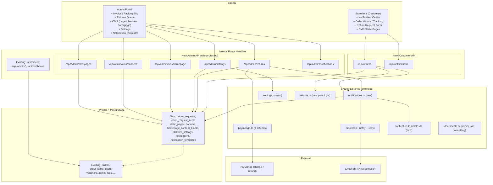
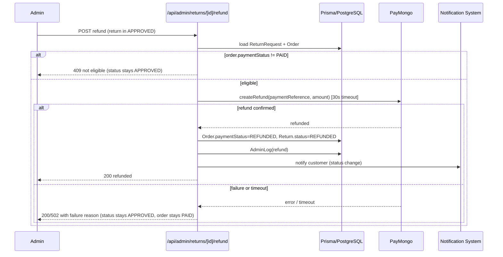
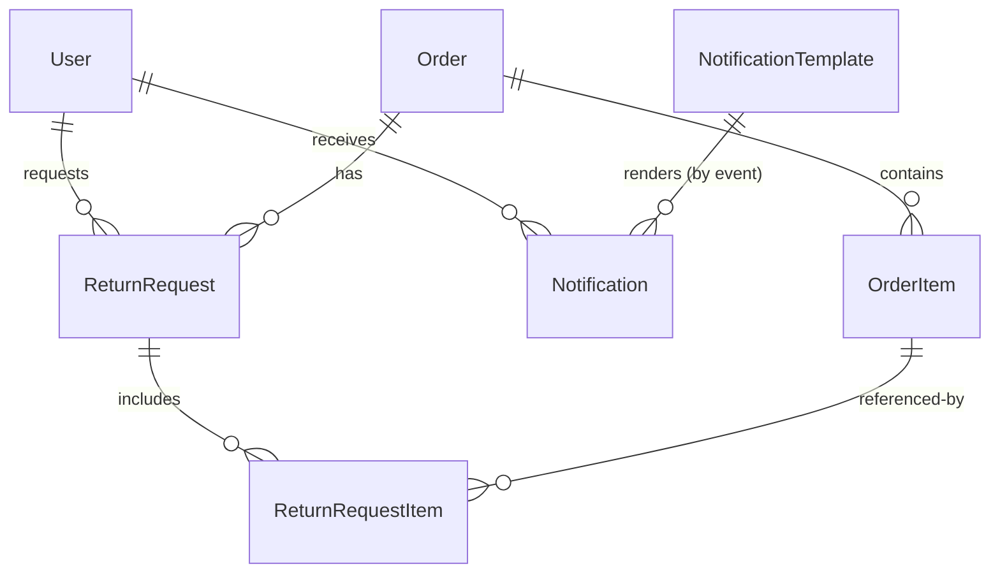

# Design Document

## Overview

The Admin & Client Management Suite adds six admin capabilities (printable
invoices, printable packing slips, returns/refunds processing, a CMS for static
pages and homepage content, platform settings, and configurable notification
automation) and two customer-facing capabilities (an in-app + email notification
center and an order history/tracking view with customer-initiated returns) to the
existing RePXL Next.js 14 application.

The design is intentionally additive. It reuses the existing PostgreSQL/Prisma
data model, session/role auth, PayMongo integration, and Nodemailer transport,
and it follows the established folder conventions. No new frameworks are
introduced: everything is built with Next.js App Router (Server Components +
Route Handlers), Prisma, Zod, Tailwind, and Framer Motion.

### Integration with existing systems

| Existing asset | How this suite uses it |
| --- | --- |
| `src/lib/prisma.ts` | All new models are queried through the shared Prisma client. |
| `src/lib/auth-helpers.ts` | `getCurrentAdmin` / `getCurrentUser` guard every new route; `isSuperAdmin` gates settings writes. |
| `src/lib/paymongo.ts` | Extended with a `createRefund` / `retrieveRefund` helper for Requirement 4. |
| `src/lib/mailer.ts` | Extended with a notification-sending helper (retry + templating) for Requirements 8–9. |
| `src/lib/validations.ts` | Extended with Zod schemas for every new form/API payload. |
| `AdminLog` model | Every admin mutation (invoice, packing slip, return status change, CMS edit, settings change, template change) writes an audit entry. |
| `Order`, `OrderItem`, `User`, `Voucher`, `NewsletterSubscriber` | Reused as-is; `Order` and `User` are extended with a small number of new fields (see Data Models). |
| `Order.paymentStatus`, `paymentReference`, `paymentIntentId` | Reused to drive refund eligibility and execution. |
| Storefront design language / admin utilitarian style | New storefront surfaces (notification center, order tracking, static pages) use the corner-bracket + condition-badge language; admin surfaces stay calm/utilitarian with monospace IDs/serials. |

### Design principles

1. **Server-first.** Printable documents, CMS-published storefront pages, order
   history, and admin lists render as Server Components with data fetched
   through Prisma. Interactive pieces (notification bell, return form, admin
   status controls) are Client Components hydrated on top.
2. **Pure logic is isolated.** Return-window checks, refund-eligibility rules,
   template placeholder resolution, slug validation, banner scheduling, and
   currency formatting live in pure functions under `src/lib` so they can be
   property-tested independently of I/O.
3. **Notifications are always in-app-first.** In-app notifications are created
   synchronously and are the source of truth; email is a best-effort channel
   with retry, so email failures never lose a notification.

---

## Architecture

### Updated system architecture (delta)



### New route groups and pages

**Admin API (guarded by `getCurrentAdmin`)**

- `POST /api/admin/orders/[orderNumber]/invoice` — records the AdminLog entry and
  returns invoice data (the printable page itself is a Server Component route).
- `POST /api/admin/orders/[orderNumber]/packing-slip` — records the AdminLog
  entry and validates required fulfillment fields.
- `/api/admin/returns` — `GET` (list), `GET /[id]`, `PATCH /[id]` (status
  transition: under-review / approve / reject), `POST /[id]/refund`.
- `/api/admin/cms/pages` — `GET`, `POST`, `PATCH /[id]`, `DELETE /[id]`.
- `/api/admin/cms/banners` — `GET`, `POST`, `PATCH /[id]`, `DELETE /[id]`.
- `/api/admin/cms/homepage` — `GET`, `PATCH /[id]` (edit block content/order),
  `POST /publish`.
- `/api/admin/settings` — `GET`, `PUT` (Super_Admin only for writes).
- `/api/admin/notifications` — `GET` (templates), `PATCH /[event]` (edit
  template), used for Requirement 8.

**Customer API (guarded by `getCurrentUser`)**

- `/api/returns` — `POST` (create request), `GET /[orderNumber]` (status for an
  order the caller owns).
- `/api/notifications` — `GET` (list + unread count), `PATCH /[id]/read`,
  `POST /read-all`, `PATCH /preferences` (promo opt-out).

**New pages**

- Admin: printable invoice route `src/app/(admin)/admin/orders/[orderNumber]/invoice/page.tsx`,
  printable packing slip `.../packing-slip/page.tsx`, returns queue
  `src/app/(admin)/admin/returns/page.tsx` + detail `.../returns/[id]/page.tsx`,
  CMS `src/app/(admin)/admin/cms/{pages,banners,homepage}/...`, settings already
  exists at `.../admin/settings/page.tsx` (extended), notification templates
  `.../admin/notifications/page.tsx`.
- Storefront: order history `src/app/(storefront)/account/orders/page.tsx`
  (extended) + tracking detail `.../account/orders/[orderNumber]/page.tsx`,
  return form `.../account/orders/[orderNumber]/return/page.tsx`, notification
  center `.../account/notifications/page.tsx`, dynamic CMS page
  `src/app/(storefront)/[slug]/page.tsx` (published static pages).

### Refund processing flow (Requirement 4)



### Notification delivery flow (Requirements 8–9)

```mermaid
sequenceDiagram
    participant SRC as Event Source (order status change, return, promo)
    participant NS as notifications.ts
    participant TPL as notification-templates.ts
    participant DB as Prisma
    participant MAIL as mailer.ts
    participant SMTP as Gmail SMTP

    SRC->>NS: emit(event, {order, user, ...})
    NS->>TPL: find template for event
    alt template disabled
        NS-->>SRC: suppressed (no-op)
    else enabled
        NS->>TPL: resolvePlaceholders(body, context)
        NS->>DB: create Notification (in-app, unread)
        opt channel includes email AND not promo-opted-out
            NS->>MAIL: send (retry up to 3)
            alt all attempts fail
                MAIL-->>NS: failure
                NS->>DB: AdminLog(delivery failure); keep in-app unread
            end
        end
    end
```

---

## Components and Interfaces

### 1. Invoice & Packing Slip (Requirements 1, 2)

**Pure formatting library** — `src/lib/documents.ts`

```ts
export interface InvoiceLine {
  productName: string
  condition: 'MINT' | 'EXCELLENT' | 'GOOD' | 'FAIR'
  unitPrice: number
  quantity: number
  lineSubtotal: number // unitPrice * quantity
}

export interface InvoiceModel {
  orderNumber: string
  orderDate: Date
  customerFullName: string
  shippingAddress: AddressSnapshot
  lines: InvoiceLine[]
  subtotal: number
  shippingCost: number
  discount: number
  total: number
  currency: string // from settings
}

/** Build invoice model from an Order (+items) and resolved currency. */
export function buildInvoiceModel(order: OrderWithItems, currency: string): InvoiceModel

/** Format a number to a currency string with exactly 2 decimals. */
export function formatMoney(amount: number, currency: string): string

export interface PackingSlipLine {
  productName: string
  condition: 'MINT' | 'EXCELLENT' | 'GOOD' | 'FAIR'
  quantity: number
  serialNumber: string | null // null → renders "not recorded"
}

export interface PackingSlipModel {
  orderNumber: string
  customerFullName: string
  shippingAddress: AddressSnapshot
  courierName: string
  courierEstimate: string
  lines: PackingSlipLine[]
}

/** Returns list of missing required fields; empty array = valid (Req 2.7). */
export function validatePackingSlip(order: OrderWithItems): string[]
export function buildPackingSlipModel(order: OrderWithItems): PackingSlipModel
```

**Printable pages** are dedicated Server Component routes with a print-oriented
stylesheet:

- A4/US-Letter page box, `@media print` rules, and a minimum 10 mm content
  inset on every edge (Req 1.4) implemented via Tailwind print utilities on a
  `.print-page` container.
- Monospace font for order number and serial numbers (admin style).
- A client "Print" button calls `window.print()`; the audit POST fires when the
  page loads.

Both generators throw a typed `DocumentError` on missing order / render failure;
the route surfaces the error banner without mutating order data (Req 1.5, 1.6,
2.6, 2.7).

### 2. Returns & Refunds (Requirements 3, 4)

**Pure logic** — `src/lib/returns.ts`

```ts
export const RETURN_WINDOW_DAYS = 30

/** Req 3.1 / 3.2: is the order inside the 30-day window as of `now`? */
export function isWithinReturnWindow(order: {
  status: OrderStatus
  deliveredAt: Date | null
  completedAt: Date | null
}, now: Date): boolean

/** Req 4.4 / 4.9 / 4.11: is the requested transition allowed from current status? */
export function canTransition(from: ReturnStatus, to: ReturnStatus): boolean

/** Req 4.9 / 4.10: refund allowed only when APPROVED and order paymentStatus PAID. */
export function isRefundEligible(returnStatus: ReturnStatus, paymentStatus: PaymentStatus): boolean

/** Req 3.6: an order may have at most one "active" (REQUESTED|UNDER_REVIEW) request. */
export function hasActiveRequest(existing: ReturnStatus[]): boolean
```

Allowed transition table:

| From \ To | UNDER_REVIEW | APPROVED | REJECTED | REFUNDED |
| --- | --- | --- | --- | --- |
| REQUESTED | ✅ | ✅ | ✅ | ❌ |
| UNDER_REVIEW | — | ✅ | ✅ | ❌ |
| APPROVED | ❌ | — | ❌ | ✅ (refund only) |
| REJECTED | ❌ | ❌ | — | ❌ |
| REFUNDED | ❌ | ❌ | ❌ | — |

**PayMongo extension** — `src/lib/paymongo.ts`

```ts
export interface RefundInput {
  paymentId: string       // from Order.paymentReference / payments[].id
  amount: number          // centavos
  reason?: 'requested_by_customer' | 'others'
}
export interface RefundResult { id: string; status: string }

/** POST /refunds; caller wraps in a 30s timeout (Req 4.12). */
export async function createRefund(input: RefundInput): Promise<RefundResult>
```

**Customer components** (storefront design language)

- `ReturnRequestForm` (client): item multi-select + reason textarea (10–1000
  chars), inline validation retaining entered data on error (Req 3.4, 3.5).
- `ReturnStatusBadge`: shows current `ReturnRequest.status` on the order view
  (Req 3.8), styled like condition badges.

**Admin components** (utilitarian)

- `ReturnQueueTable`: list sorted by request date desc, empty-state row (Req 4.1,
  4.2).
- `ReturnDetailPanel`: order details + selected items + reason; action buttons
  gated by `canTransition`; reject modal requires 1–500 char reason (Req 4.6,
  4.7); refund button visible only when `APPROVED` (Req 4.8).

### 3. CMS (Requirements 5, 6)

- `src/lib/cms.ts`: `isValidSlug(slug)` (lowercase letters/digits/hyphens,
  1–100), `isBannerVisible(banner, now)` (active + within schedule),
  `validateSchedule(start, end)` (start strictly before end).
- Admin components: `StaticPageTable`, `StaticPageForm`, `BannerTable`,
  `BannerForm`, `HomepageBlockEditor`.
- Storefront dynamic route `[slug]/page.tsx`: looks up a published `StaticPage`;
  returns `notFound()` for draft pages to non-admins (Req 5.7). Published pages
  render with the storefront layout and corner-bracket framing.
- Homepage reads `HomepageContentBlock` rows ordered by `displayOrder` and only
  `isPublished` blocks; banners filtered through `isBannerVisible`.

### 4. Platform Settings (Requirement 7)

- `src/lib/settings.ts`: typed accessors backed by `PlatformSetting` rows plus a
  short-lived in-process cache.

```ts
export interface ShippingOption { name: string; cost: number }
export interface PaymentOption { key: string; label: string; enabled: boolean }
export interface PlatformSettings {
  currency: string
  shippingOptions: ShippingOption[]
  paymentOptions: PaymentOption[]
}
export async function getSettings(): Promise<PlatformSettings>
export async function updateSettings(patch: Partial<PlatformSettings>, admin: SessionUser): Promise<PlatformSettings>
```

- Settings page renders read-only for non-Super_Admins (Req 7.10) by checking
  `session.isSuperAdmin` and disabling inputs.
- Storefront checkout and money formatting read `getSettings()` for currency,
  shipping options, and enabled payment options (Req 7.2–7.4); a warning shows
  when no payment option is enabled (Req 7.7).

### 5. Notifications (Requirements 8, 9)

- `src/lib/notification-templates.ts`:

```ts
export type NotificationEvent =
  | 'ORDER_CONFIRMATION' | 'ORDER_STATUS_CHANGE'
  | 'RETURN_RECEIVED' | 'RETURN_STATUS_CHANGE' | 'REFUND_COMPLETED' | 'PROMOTION'

/** Tokens allowed per event, e.g. {{orderNumber}}, {{customerName}}, {{status}}. */
export const ALLOWED_TOKENS: Record<NotificationEvent, string[]>

/** Req 8.4: replace known tokens with context values. */
export function resolvePlaceholders(body: string, context: Record<string, string>): string

/** Req 8.5: returns unknown tokens used in body (empty = valid). */
export function findUnknownTokens(body: string, event: NotificationEvent): string[]
```

- `src/lib/notifications.ts`:

```ts
export async function emitNotification(event: NotificationEvent, ctx: NotificationContext): Promise<void>
export async function markRead(userId: string, notificationId: string): Promise<void>
export async function markAllRead(userId: string): Promise<void>
export function displayUnreadCount(count: number): string // Req 9.4 → "99+" when > 99
```

- `mailer.ts` gains `sendNotificationEmail(to, subject, body)` with an internal
  retry helper (up to 3 attempts). In-app notification creation is independent of
  email outcome (Req 9.7, 9.8).
- `NotificationBell` (client) polls `/api/notifications` for unread count;
  `NotificationCenter` lists notifications and marks read on open (Req 9.5) and
  supports "mark all read" (Req 9.6).

### 6. Order History & Tracking (Requirement 10)

- `OrderHistoryList` (server): caller's orders sorted by date desc; empty state
  (Req 10.1, 10.7).
- `OrderTrackingView` (server): status stepper across PROCESSING → SHIPPED →
  DELIVERED → COMPLETED marking completed/current; CANCELLED suppresses the
  stepper (Req 10.2, 10.4); shows courier name/estimate when present (Req 10.3).
- Ownership enforced in the route: an order not owned by the caller returns a
  403 with no data (Req 10.6).

---

## Data Models

New Prisma models and enums, plus small extensions to `User` and `Order`.

### New enums

```prisma
enum ReturnStatus {
  REQUESTED
  UNDER_REVIEW
  APPROVED
  REJECTED
  REFUNDED
}

enum PageStatus {
  DRAFT
  PUBLISHED
}

enum BannerPlacement {
  HOMEPAGE_HERO
  HOMEPAGE_STRIP
  SIDEBAR
}

enum NotificationEvent {
  ORDER_CONFIRMATION
  ORDER_STATUS_CHANGE
  RETURN_RECEIVED
  RETURN_STATUS_CHANGE
  REFUND_COMPLETED
  PROMOTION
}

enum NotificationChannel {
  IN_APP
  EMAIL
  BOTH
}
```

### Extensions to existing models

```prisma
model User {
  // ... existing fields ...
  promoOptOut Boolean @default(false) @map("promo_opt_out") // Req 9.9

  notifications Notification[]
  returnRequests ReturnRequest[]
}

model Order {
  // ... existing fields ...
  deliveredAt DateTime? @map("delivered_at") // Req 3.1/3.2 return window basis
  completedAt DateTime? @map("completed_at")

  returnRequests ReturnRequest[]
}
```

`deliveredAt` / `completedAt` are set when the admin transitions an order to
`DELIVERED` / `COMPLETED` (small change to the existing order-status update
handler). They provide the concrete date the 30-day window is measured from.

### Returns

```prisma
model ReturnRequest {
  id              String       @id @default(cuid())
  orderId         String       @map("order_id")
  userId          String       @map("user_id")
  status          ReturnStatus @default(REQUESTED)
  reason          String       // 10–1000 chars (validated in app layer)
  rejectionReason String?      @map("rejection_reason") // 1–500 chars when REJECTED
  refundId        String?      @map("refund_id") // PayMongo refund id
  createdAt       DateTime     @default(now()) @map("created_at")
  updatedAt       DateTime     @updatedAt @map("updated_at")

  order Order               @relation(fields: [orderId], references: [id], onDelete: Cascade)
  user  User                @relation(fields: [userId], references: [id], onDelete: Cascade)
  items ReturnRequestItem[]

  @@index([orderId])
  @@index([status])
  @@map("return_requests")
}

model ReturnRequestItem {
  id              String @id @default(cuid())
  returnRequestId String @map("return_request_id")
  orderItemId     String @map("order_item_id")
  quantity        Int

  returnRequest ReturnRequest @relation(fields: [returnRequestId], references: [id], onDelete: Cascade)

  @@map("return_request_items")
}
```

> Partial unique enforcement of "one active request per order" (Req 3.6) is done
> in the application layer inside a transaction (Prisma cannot express a filtered
> unique index declaratively for arbitrary status sets); the check uses
> `hasActiveRequest` against a `SELECT ... FOR UPDATE`-style guarded query.

### CMS

```prisma
model StaticPage {
  id        String     @id @default(cuid())
  slug      String     @unique // 1–100, lowercase/digits/hyphen
  title     String     // 1–200
  body      String     // 1–100000
  status    PageStatus @default(DRAFT)
  createdAt DateTime   @default(now()) @map("created_at")
  updatedAt DateTime   @updatedAt @map("updated_at")

  @@map("static_pages")
}

model Banner {
  id         String          @id @default(cuid())
  title      String          // 1–120
  imageRef   String          @map("image_ref")
  placement  BannerPlacement
  linkTarget String          @map("link_target") // valid URL
  startDate  DateTime?       @map("start_date")
  endDate    DateTime?       @map("end_date")
  isActive   Boolean         @default(true) @map("is_active")
  createdAt  DateTime        @default(now()) @map("created_at")
  updatedAt  DateTime        @updatedAt @map("updated_at")

  @@map("banners")
}

model HomepageContentBlock {
  id           String   @id @default(cuid())
  type         String   // e.g. "featured", "editorial", "brand_gallery"
  content      Json     // structured block content
  displayOrder Int      @map("display_order") // 1–999
  isPublished  Boolean  @default(false) @map("is_published")
  createdAt    DateTime @default(now()) @map("created_at")
  updatedAt    DateTime @updatedAt @map("updated_at")

  @@map("homepage_content_blocks")
}
```

### Settings

```prisma
model PlatformSetting {
  id        String   @id @default(cuid())
  key       String   @unique // "currency" | "shippingOptions" | "paymentOptions"
  value     Json     // scalar or structured value
  updatedAt DateTime @updatedAt @map("updated_at")

  @@map("platform_settings")
}
```

A key/value + JSON design keeps settings extensible without schema churn.
`currency` stores a string; `shippingOptions` / `paymentOptions` store arrays.

### Notifications

```prisma
model NotificationTemplate {
  event     NotificationEvent   @unique
  subject   String              // 1–200
  body      String              // 1–10000
  channel   NotificationChannel @default(BOTH)
  isEnabled Boolean             @default(true) @map("is_enabled")
  updatedAt DateTime            @updatedAt @map("updated_at")

  @@map("notification_templates")
}

model Notification {
  id        String              @id @default(cuid())
  userId    String              @map("user_id")
  event     NotificationEvent
  message   String              // rendered text, ≤ 500 chars for display
  channel   NotificationChannel
  isRead    Boolean             @default(false) @map("is_read")
  createdAt DateTime            @default(now()) @map("created_at")

  user User @relation(fields: [userId], references: [id], onDelete: Cascade)

  @@index([userId, isRead])
  @@map("notifications")
}
```

### Entity relationships



### Migration approach

- Add fields/models to `prisma/schema.prisma`, then generate a migration with
  `npx prisma migrate dev --name admin_client_management_suite` (locally) and
  apply in CI/prod via `npx prisma migrate deploy` (matching the existing
  `.github/workflows/db-migrate.yml`).
- All new columns are nullable or have defaults, so the migration is
  non-destructive against existing rows (`promoOptOut` defaults false,
  `deliveredAt`/`completedAt` nullable).
- Seed default `NotificationTemplate` rows (one per event) and default
  `PlatformSetting` rows (currency, shipping, payment) in `prisma/seed.ts` so the
  system has working defaults on first deploy.

---

## Correctness Properties

*A property is a characteristic or behavior that should hold true across all valid
executions of a system — essentially, a formal statement about what the system
should do. Properties serve as the bridge between human-readable specifications and
machine-verifiable correctness guarantees.*

The following properties target the pure-logic core of the suite (document
building, return workflow rules, CMS validation, settings, notification
templating/state, and order tracking). Side-effecting, timing, and
external-service criteria are covered by unit/integration tests in the Testing
Strategy instead.

### Property 1: Invoice totals and required fields are consistent

*For any* order with a set of line items, the built invoice model SHALL contain the
order number, order date, customer full name, and shipping address, one row per
line item whose line subtotal equals unit price times quantity, and an order total
equal to subtotal plus shipping cost minus discount.

**Validates: Requirements 1.2**

### Property 2: Monetary formatting always has exactly two decimals

*For any* non-negative amount and configured currency, `formatMoney` SHALL produce
a string whose numeric portion has exactly two decimal places.

**Validates: Requirements 1.3**

### Property 3: Packing slip contains required fulfillment fields per item

*For any* valid order, the built packing slip model SHALL include the order number,
customer full name, shipping address, courier name and estimate, and one row per
line item containing the product name, a condition grade in {MINT, EXCELLENT, GOOD,
FAIR}, and quantity.

**Validates: Requirements 2.2**

### Property 4: Serial number presence is rendered explicitly

*For any* packing slip line item, the model SHALL display the recorded serial
number when one exists and an explicit "not recorded" indicator when none exists.

**Validates: Requirements 2.3**

### Property 5: Packing slip never exposes prices or totals

*For any* order, the built packing slip model SHALL contain no per-item price and no
order total fields.

**Validates: Requirements 2.4**

### Property 6: Packing slip validation identifies missing required fields

*For any* order, `validatePackingSlip` SHALL return exactly the set of required
fulfillment fields (order number, customer full name, shipping address) that are
missing, and SHALL return an empty set only when all are present.

**Validates: Requirements 2.7**

### Property 7: Return window is enforced by status and date

*For any* order status and delivery/completion date relative to a reference time,
`isWithinReturnWindow` SHALL return true if and only if the status is DELIVERED or
COMPLETED and the relevant date is within the preceding 30 calendar days.

**Validates: Requirements 3.1, 3.2**

### Property 8: Valid return submissions create a linked REQUESTED request

*For any* submission with at least one selected order item and a reason of length
10 to 1000, creating the return SHALL produce a ReturnRequest linked to the order
containing exactly the selected items, the provided reason, and status REQUESTED.

**Validates: Requirements 3.3, 3.4**

### Property 9: Invalid return submissions are rejected with offending fields

*For any* submission that selects zero items or supplies a reason shorter than 10 or
longer than 1000 characters, the validator SHALL reject the submission, create no
ReturnRequest, and report each invalid field.

**Validates: Requirements 3.5**

### Property 10: At most one active return request per order

*For any* set of existing return statuses for an order, `hasActiveRequest` SHALL
return true if and only if the set contains REQUESTED or UNDER_REVIEW, and a new
submission SHALL be rejected exactly when it returns true.

**Validates: Requirements 3.6**

### Property 11: Return status transitions follow the allowed table

*For any* pair of return statuses (from, to), `canTransition` SHALL return true only
for the transitions REQUESTED→UNDER_REVIEW, REQUESTED→APPROVED, REQUESTED→REJECTED,
UNDER_REVIEW→APPROVED, UNDER_REVIEW→REJECTED, and APPROVED→REFUNDED, and false for
every other pair.

**Validates: Requirements 4.4, 4.5, 4.6**

### Property 12: Whitespace-only rejection reasons are refused

*For any* string consisting solely of whitespace, rejecting a return with that
reason SHALL be refused, leaving the return status unchanged.

**Validates: Requirements 4.7**

### Property 13: Refund eligibility requires APPROVED and PAID

*For any* pair of return status and order payment status, `isRefundEligible` SHALL
return true if and only if the return status is APPROVED and the payment status is
PAID.

**Validates: Requirements 4.9, 4.10**

### Property 14: Static page and banner lists are ordered

*For any* set of static pages, the rendered list SHALL be ordered by last-updated
timestamp in non-increasing order.

**Validates: Requirements 5.1**

### Property 15: Static page validation enforces field rules

*For any* static page input, the validator SHALL accept it only when the title is 1
to 200 characters, the slug is 1 to 100 characters of lowercase letters, digits,
and hyphens, and the body is 1 to 100,000 characters, and SHALL otherwise reject it
while reporting each invalid field.

**Validates: Requirements 5.3, 5.4**

### Property 16: Static page slugs are unique

*For any* set of existing slugs and a candidate slug, creation SHALL be rejected if
and only if the candidate already exists in the set.

**Validates: Requirements 5.5**

### Property 17: Draft pages are hidden from non-admins

*For any* static page status and viewer role, a non-admin request SHALL receive a
not-found response if and only if the page status is DRAFT.

**Validates: Requirements 5.7**

### Property 18: Banner field validation

*For any* banner input, the validator SHALL accept it only when the title is 1 to
120 characters, the image reference is present, the placement is in the defined
placement set, and the link target is a valid URL, and SHALL otherwise reject it
while reporting each invalid field.

**Validates: Requirements 6.2, 6.3**

### Property 19: Banner schedule requires start before end

*For any* pair of start and end dates, `validateSchedule` SHALL accept the schedule
if and only if the start date is strictly earlier than the end date.

**Validates: Requirements 6.4**

### Property 20: Banner visibility respects active state and schedule

*For any* banner and reference time, `isBannerVisible` SHALL return true if and only
if the banner is active and, when a schedule is set, the reference time is on or
after the start date and on or before the end date; a disabled banner SHALL never
be visible.

**Validates: Requirements 6.5, 6.6**

### Property 21: Homepage block validation

*For any* homepage content block input, the validator SHALL accept it only when the
content is non-empty and the display order is an integer from 1 to 999, and SHALL
otherwise reject it while reporting each invalid field.

**Validates: Requirements 6.7, 6.8**

### Property 22: Currency setting round-trips

*For any* supported currency, saving it via `updateSettings` and then reading via
`getSettings` SHALL return the saved currency.

**Validates: Requirements 7.2**

### Property 23: Shipping option validation

*For any* shipping option input and existing option set, the validator SHALL accept
it only when the name is 1 to 60 characters and not a duplicate and the cost is
between 0.00 and 999,999.99 inclusive, and SHALL otherwise reject it while reporting
the invalid field.

**Validates: Requirements 7.3, 7.5, 7.6**

### Property 24: Checkout excludes disabled payment options

*For any* set of payment options, the checkout payment selection SHALL contain
exactly the options whose enabled state is true.

**Validates: Requirements 7.4**

### Property 25: Checkout-unavailable warning when no payment enabled

*For any* set of payment options, the settings view SHALL display the
checkout-unavailable warning if and only if no payment option is enabled.

**Validates: Requirements 7.7**

### Property 26: Settings writes require Super_Admin

*For any* admin session, a settings write SHALL be permitted if and only if the
admin's `isSuperAdmin` flag is true; otherwise the settings SHALL be presented in
read-only mode.

**Validates: Requirements 7.10**

### Property 27: Notification template validation

*For any* template input, the validator SHALL accept it only when the subject is 1
to 200 characters and the body is 1 to 10,000 characters, and SHALL otherwise reject
it while retaining previously persisted values and reporting the invalid field.

**Validates: Requirements 8.2, 8.3**

### Property 28: Defined placeholder tokens are fully resolved

*For any* template body containing only tokens defined for its event and a matching
context, `resolvePlaceholders` SHALL produce output containing no unresolved defined
tokens, each replaced by its corresponding value.

**Validates: Requirements 8.4**

### Property 29: Unknown placeholder tokens are detected

*For any* template body and associated event, `findUnknownTokens` SHALL return
exactly the set of tokens used in the body that are not defined for that event, and
saving SHALL be rejected when that set is non-empty.

**Validates: Requirements 8.5**

### Property 30: Disabled templates suppress notifications

*For any* notification event whose template is disabled, `emitNotification` SHALL
create no Notification and send no email for that event.

**Validates: Requirements 8.6**

### Property 31: Displayed notification message is bounded

*For any* notification, the message text presented in the Notification Center SHALL
be at most 500 characters, alongside its event and creation timestamp.

**Validates: Requirements 9.3**

### Property 32: Unread count display rule

*For any* unread count, `displayUnreadCount` SHALL return the count's decimal string
when it is 0 to 99 and SHALL return "99+" when it exceeds 99.

**Validates: Requirements 9.4**

### Property 33: Marking a notification read decrements the unread count by one

*For any* set of notifications containing at least one unread item, marking a single
unread notification as read SHALL set that notification to read and reduce the
unread count by exactly one.

**Validates: Requirements 9.5**

### Property 34: Mark-all-read clears unread and is idempotent

*For any* set of notifications for a customer, marking all as read SHALL leave no
unread notifications and set the unread count to zero, and applying the operation
again SHALL produce the same result.

**Validates: Requirements 9.6**

### Property 35: In-app notification is retained regardless of email outcome

*For any* notification whose delivery includes email, the in-app notification SHALL
exist and be retained regardless of whether email delivery succeeds or fails.

**Validates: Requirements 9.7**

### Property 36: Promotional opt-out excludes only promotions

*For any* customer and notification event, a promotional notification SHALL be
excluded if and only if the customer has opted out of promotional notifications,
while order-related notifications SHALL always be created.

**Validates: Requirements 9.9**

### Property 37: Order history is ordered by date descending

*For any* set of a customer's orders, the order history view SHALL present them
ordered by order date in non-increasing order, each showing order number, date,
total, and current status.

**Validates: Requirements 10.1**

### Property 38: Order status progression reflects the current state

*For any* order status, the tracking stepper SHALL mark every state up to and
including the current state as reached and every later state as not reached across
PROCESSING → SHIPPED → DELIVERED → COMPLETED, and SHALL suppress the progression
entirely when the status is CANCELLED.

**Validates: Requirements 10.2, 10.4**

### Property 39: Order access is restricted to the owner

*For any* pair of requesting customer and order owner, order detail data SHALL be
returned if and only if the requester is the owner; otherwise access SHALL be denied
with no order data disclosed.

**Validates: Requirements 10.6**

---

## Error Handling

| Area | Failure | Handling |
| --- | --- | --- |
| Invoice / packing slip | Order not found (Req 1.5, 2.6) | Route returns a not-found error banner; no document; order untouched. |
| Invoice / packing slip | Render failure (Req 1.6) | Typed `DocumentError` caught; error banner shown; order data unchanged. |
| Packing slip | Missing required fulfillment field (Req 2.7) | `validatePackingSlip` returns missing fields; route names them and skips rendering. |
| Returns | Invalid submission (Req 3.5) | Zod + `returns.ts` validation returns field-level errors; entered data retained client-side; no DB write. |
| Returns | Duplicate active request (Req 3.6) | Transactional guard rejects with "request already in progress"; no new row. |
| Returns | Invalid status transition (Req 4.4–4.7) | `canTransition` guard rejects; status unchanged; error surfaced. Empty rejection reason rejected before write. |
| Refunds | Order not PAID (Req 4.10) | `isRefundEligible` false → 409; return stays APPROVED. |
| Refunds | Gateway failure/timeout (Req 4.12) | 30s timeout wrapper around `createRefund`; on error/timeout, statuses unchanged, failure reason returned to admin. |
| CMS | Invalid page/banner/block (Req 5.4, 6.3, 6.8) | Field-level validation errors; values retained; no write. |
| CMS | Duplicate slug (Req 5.5) | Unique constraint + pre-check → "slug already in use". |
| Settings | Invalid shipping option (Req 7.5, 7.6) | Validation errors returned; values retained. |
| Settings | Persistence failure (Req 7.9) | Previous value retained; storefront unchanged; "could not be saved" message. |
| Settings | Non-Super_Admin write (Req 7.10) | Inputs disabled; server rejects writes with 403. |
| Notifications | Invalid/unknown-token template (Req 8.3, 8.5) | Validation rejects; previously persisted template retained; offending field/token reported. |
| Notifications | Email send failure (Req 8.8, 9.7, 9.8) | Retry up to 3 attempts; in-app notification retained; AdminLog records the delivery failure; in-app stays unread. |
| Order history/tracking | Load failure (Req 10.8) | Current view retained with no partial data; "orders could not be retrieved" error. |
| Order history/tracking | Access to another customer's order (Req 10.6) | 403; no order data returned. |

All admin mutations are wrapped so that an audit `AdminLog` write and the primary
mutation occur in a single Prisma transaction where the requirement pairs them,
preventing an action from being applied without its audit trail.

---

## Testing Strategy

The suite uses a dual testing approach with the existing stack: **Vitest** for
unit and property tests, **Testing Library** for component tests, and
**Playwright** for end-to-end flows.

### Property-based testing

- Library: **fast-check** with Vitest (`@fast-check/vitest`) — the standard PBT
  choice for the TypeScript/Vitest ecosystem. Property-based testing is
  appropriate here because the suite's core rules (return window, status
  transitions, refund eligibility, template resolution, slug/banner/settings
  validation, notification state, order tracking) are pure functions with large
  input spaces and clear universal properties.
- Each of the 39 correctness properties above is implemented as a **single**
  property-based test running a **minimum of 100 iterations**.
- Each property test is tagged with a comment referencing its design property in
  the format: **Feature: admin-client-management-suite, Property {number}:
  {property_text}**.
- Custom generators (arbitraries) produce orders with items, return status sets,
  date/now pairs for window and schedule checks, template bodies mixing defined
  and undefined tokens, notification sets, payment/shipping option sets, and
  slugs with valid/invalid character sets.

### Unit tests (example-based)

- Empty-state rendering (Req 4.2, 5.2, 10.7).
- Error/failure paths: missing order (Req 1.5, 2.6), render failure (Req 1.6),
  settings persistence failure (Req 7.9), order load failure (Req 10.8).
- Audit-log side effects verified with mocked `prisma.adminLog.create`
  (Req 1.7, 2.5, 4.14, 5.9, 6.10, 7.8, 8.9).
- Conditional rendering of courier fields (Req 10.3) and refund control gating
  (Req 4.8).

### Component tests (Testing Library)

- Print page layout: A4/Letter box and 10 mm inset classes present (Req 1.4).
- Return request form validation UX retaining entered data (Req 3.5).
- Notification bell/center: unread badge, mark-read, mark-all-read interactions
  (Req 9.4–9.6).
- Settings read-only mode for non-Super_Admins (Req 7.10).

### Integration tests (1–3 representative examples each)

- Refund success and failure/timeout against a mocked PayMongo `createRefund`
  (Req 4.11, 4.12).
- Published static page and homepage content served after publish (Req 5.6, 5.8,
  6.9).
- Email delivery attempted when channel includes email, and retry-then-fail
  recording (Req 8.8, 9.2, 9.8) against a mocked mailer transport.
- Order-confirmation and status-change notifications created within their
  windows using mocked timers (Req 3.7, 8.7, 9.1).

### End-to-end tests (Playwright)

- **Return/refund flow:** customer submits a return within the window → admin
  marks under review → approves → processes refund → order shows REFUNDED and
  customer receives a status notification.
- **Notification flow:** admin changes an order status → customer sees an in-app
  notification, unread count updates, opening it marks it read, mark-all-read
  clears the badge.
- **CMS flow:** admin creates and publishes a static page → page is reachable at
  its slug on the storefront; a draft page 404s for anonymous visitors.

### Test data and migration verification

- A dedicated test seed extends `prisma/seed.ts` with default notification
  templates and platform settings so integration/E2E runs start from a known
  baseline.
- The Prisma migration is verified locally with `npx prisma migrate dev` and in
  CI with `npx prisma migrate deploy`, confirming the additive schema applies
  cleanly against existing data.
