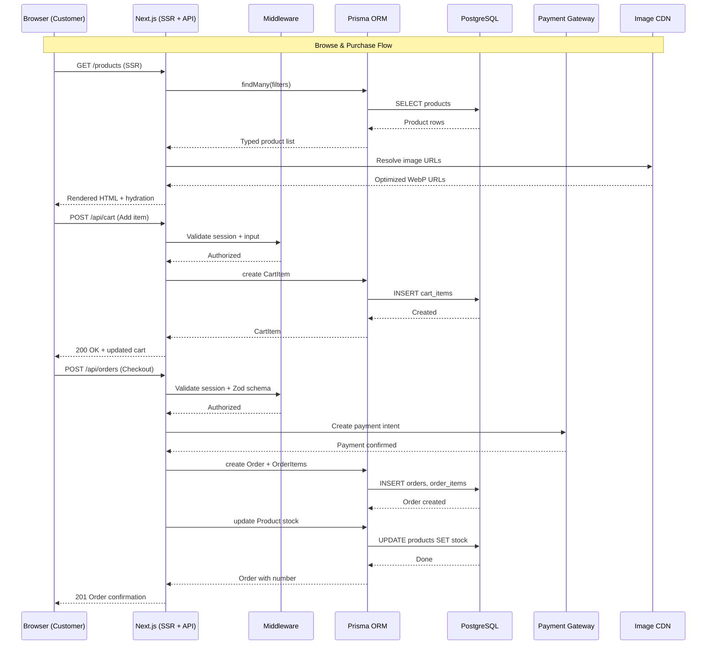

# RePXL — System Architecture Diagram

> **Accuracy note (last reviewed during the documentation audit):** the stack, payment gateway (PayMongo), email (Gmail SMTP), image CDN (Cloudinary), and auth model shown below reflect the current implementation. The diagrams focus on the core browse/purchase path; additional implemented subsystems not drawn here include Returns & refunds, customer MFA (TOTP) and OTP-guarded sensitive changes, in-app + email notifications, the CMS (pages/banners/homepage blocks), order tracking (SSE), Supabase Row-Level Security (defense-in-depth), the storefront floating **AI Concierge chat widget** (client-side, local rule-based logic shared with the mobile app — no chat backend; see [`chat-widget.md`](./chat-widget.md)), and the **Cameras catalog** filtering/sorting/pagination UI (client-side, centralized in `src/lib/catalog-filters.ts`; dynamic-bounds dual-handle price slider, custom sort listbox, real review-backed Rating filter, 12/page pagination reflected in `?page=`; see [`catalog.md`](./catalog.md)). For the fullest, evidence-based map see [`kiro-repository-onboarding.md`](./kiro-repository-onboarding.md).

## High-Level Overview


```mermaid
graph TB
    %% ─── CLIENTS ────────────────────────────────────────────────────────────────
    subgraph Clients ["Clients (Web + Mobile)"]
        direction LR
        CS["Customer/Buyer Site<br/><i>Next.js App Router (SSR/SSG)</i><br/>─────────────────<br/>Landing Page<br/>Product Listing & PDP<br/>Compare View<br/>Cart & Checkout<br/>Account & Wishlist<br/>Reviews"]
        MC["Customer Mobile App<br/><i>Expo / React Native</i><br/>─────────────────<br/>Catalog & Cart<br/>Checkout<br/>Orders & Tracking<br/>Returns & Reviews<br/>Notifications"]
        AS["Admin Dashboard<br/><i>Next.js App Router (CSR)</i><br/>─────────────────<br/>Sales Overview<br/>Inventory Management<br/>Order Management<br/>Customer Management<br/>Vouchers & Logs<br/>Reports & Settings"]
    end

    %% ─── FRONTEND LAYER ─────────────────────────────────────────────────────────
    subgraph Frontend ["Frontend Layer"]
        direction LR
        RC["React Components<br/><i>Custom UI Library</i>"]
        RN["Native UI<br/><i>Expo / React Native</i>"]
        TW["Tailwind CSS<br/><i>Design Tokens</i>"]
        FM["Framer Motion<br/><i>Animations</i>"]
        ZS["Zustand Stores<br/><i>Cart, Wishlist, Auth State</i>"]
    end

    %% ─── API LAYER ──────────────────────────────────────────────────────────────
    subgraph API ["Next.js API Routes (Backend)"]
        direction TB
        subgraph PublicAPI ["Public API"]
            AP_PROD["/api/products<br/><i>List, Filter, Search, [slug]</i>"]
            AP_CART["/api/cart<br/><i>Add, Update, Remove, Get</i>"]
            AP_ORDER["/api/orders<br/><i>Create, History, [orderNumber]</i>"]
            AP_REV["/api/reviews<br/><i>Create, List by Product</i>"]
            AP_WISH["/api/wishlist<br/><i>Add, Remove, List</i>"]
            AP_ADDR["/api/addresses<br/><i>CRUD User Addresses</i>"]
            AP_VOUCH["/api/vouchers<br/><i>Validate Codes</i>"]
        end
        subgraph AuthAPI ["Auth API"]
            AP_AUTH["/api/auth<br/><i>NextAuth.js</i><br/>Login, Register, Logout<br/>Session, Change Password"]
            AP_MOBILE_AUTH["/api/mobile/auth<br/><i>Bearer sessions</i><br/>Login, MFA, Refresh, Logout"]
        end
        subgraph AdminAPI ["Admin API (Role-Protected)"]
            AP_ADM_STAT["/api/admin/stats<br/><i>Dashboard Metrics</i>"]
            AP_ADM_CUST["/api/admin/customers<br/><i>Customer Management</i>"]
            AP_ADM_ACC["/api/admin/accounts<br/><i>Admin Accounts</i>"]
            AP_ADM_LOG["/api/admin/logs<br/><i>Activity Logs</i>"]
        end
    end

    %% ─── MIDDLEWARE ─────────────────────────────────────────────────────────────
    MW["Middleware<br/><i>Auth Guards, Role Checks,<br/>Input Validation (Zod),<br/>CSRF, Rate Limiting</i>"]

    %% ─── DATABASE ───────────────────────────────────────────────────────────────
    subgraph Database ["Database Layer"]
        PRISMA["Prisma ORM<br/><i>Type-safe queries,<br/>Migrations, Seeding</i>"]
        PG[("PostgreSQL<br/>─────────────────<br/>users<br/>products<br/>cart_items<br/>orders / order_items<br/>reviews<br/>addresses<br/>wishlist_items<br/>vouchers<br/>mobile_sessions<br/>push_tokens<br/>admin_logs")]
    end

    %% ─── EXTERNAL SERVICES ──────────────────────────────────────────────────────
    subgraph External ["External Services"]
        direction LR
        PAY["Payment Gateway<br/><i>PayMongo Hosted Checkout</i><br/>─────────────────<br/>Checkout Session, Refund,<br/>Signed Webhooks"]
        IMG["Image CDN<br/><i>Cloudinary</i><br/>─────────────────<br/>Review images (public),<br/>Return evidence (signed)"]
        EMAIL["Email Service<br/><i>Gmail SMTP (Nodemailer)</i><br/>─────────────────<br/>Order Confirmations,<br/>Password Reset, OTP, Newsletter"]
        PUSH["Expo Push Service<br/><i>Optional native notifications</i>"]
    end

    %% ─── DEPLOYMENT ─────────────────────────────────────────────────────────────
    subgraph Deploy ["Deployment"]
        VER["Vercel<br/><i>Hosting, Edge Network,<br/>Preview Deploys, SSL</i>"]
    end

    %% ─── CONNECTIONS ────────────────────────────────────────────────────────────
    CS --> RC
    MC --> RN
    AS --> RC
    RC --> TW
    RC --> FM
    RC --> ZS

    CS -->|"HTTP Requests"| MW
    MC -->|"HTTPS + Bearer Tokens"| MW
    AS -->|"HTTP Requests"| MW
    MW --> API

    AP_PROD --> PRISMA
    AP_CART --> PRISMA
    AP_ORDER --> PRISMA
    AP_REV --> PRISMA
    AP_WISH --> PRISMA
    AP_ADDR --> PRISMA
    AP_VOUCH --> PRISMA
    AP_AUTH --> PRISMA
    AP_MOBILE_AUTH --> PRISMA
    AP_ADM_STAT --> PRISMA
    AP_ADM_CUST --> PRISMA
    AP_ADM_ACC --> PRISMA
    AP_ADM_LOG --> PRISMA

    PRISMA --> PG

    AP_ORDER -->|"Process Payment"| PAY
    PAY -->|"Webhook (payment_confirmed)"| AP_ORDER
    AP_PROD -->|"Fetch Optimized Images"| IMG
    AP_ORDER -.->|"Send Notification"| EMAIL
    API -.->|"Push notification"| PUSH

    API --> VER
    PG --> VER
```

## Data Flow Summary


```mermaid
sequenceDiagram
    participant B as Browser (Customer)
    participant N as Next.js (SSR + API)
    participant M as Middleware
    participant P as Prisma ORM
    participant DB as PostgreSQL
    participant PG as Payment Gateway
    participant CDN as Image CDN

    Note over B,CDN: Browse & Purchase Flow

    B->>N: GET /products (SSR)
    N->>P: findMany(filters)
    P->>DB: SELECT products
    DB-->>P: Product rows
    P-->>N: Typed product list
    N->>CDN: Resolve image URLs
    CDN-->>N: Optimized WebP URLs
    N-->>B: Rendered HTML + hydration

    B->>N: POST /api/cart (Add item)
    N->>M: Validate session + input
    M-->>N: Authorized
    N->>P: create CartItem
    P->>DB: INSERT cart_items
    DB-->>P: Created
    P-->>N: CartItem
    N-->>B: 200 OK + updated cart

    B->>N: POST /api/orders (Checkout)
    N->>M: Validate session + Zod schema
    M-->>N: Authorized
    N->>PG: Create payment intent
    PG-->>N: Payment confirmed
    N->>P: create Order + OrderItems
    P->>DB: INSERT orders, order_items
    DB-->>P: Order created
    N->>P: update Product stock
    P->>DB: UPDATE products SET stock
    DB-->>P: Done
    P-->>N: Order with number
    N-->>B: 201 Order confirmation
```

## Component Interaction Map

```
┌─────────────────────────────────────────────────────────────────────────┐
│                          BROWSER (CLIENT)                                │
├────────────────────────────────┬────────────────────────────────────────┤
│   CUSTOMER STOREFRONT          │        ADMIN DASHBOARD                  │
│                                │                                         │
│  ┌──────────┐ ┌──────────┐    │   ┌──────────┐ ┌──────────┐           │
│  │ Landing  │ │ Products │    │   │ Overview │ │Inventory │           │
│  │  Page    │ │ Listing  │    │   │  Stats   │ │  Table   │           │
│  └──────────┘ └──────────┘    │   └──────────┘ └──────────┘           │
│  ┌──────────┐ ┌──────────┐    │   ┌──────────┐ ┌──────────┐           │
│  │  PDP     │ │ Compare  │    │   │  Orders  │ │Customers │           │
│  │ (Detail) │ │  View    │    │   │  Mgmt    │ │  Mgmt    │           │
│  └──────────┘ └──────────┘    │   └──────────┘ └──────────┘           │
│  ┌──────────┐ ┌──────────┐    │   ┌──────────┐ ┌──────────┐           │
│  │   Cart   │ │ Checkout │    │   │ Vouchers │ │   Logs   │           │
│  └──────────┘ └──────────┘    │   └──────────┘ └──────────┘           │
│  ┌──────────┐ ┌──────────┐    │                                         │
│  │ Account  │ │ Wishlist │    │                                         │
│  └──────────┘ └──────────┘    │                                         │
├────────────────────────────────┴────────────────────────────────────────┤
│                    Zustand (Client State)                                │
│            Cart Store │ Wishlist Store │ Auth Store                      │
└─────────────────────────────────┬───────────────────────────────────────┘
                                  │ HTTP (fetch / Server Components)
                                  ▼
┌─────────────────────────────────────────────────────────────────────────┐
│                     NEXT.JS SERVER (Vercel)                              │
├─────────────────────────────────────────────────────────────────────────┤
│  Middleware: Auth Guards │ Role-Based Access │ Zod Validation │ CSRF    │
├──────────────┬──────────────┬───────────────┬───────────────────────────┤
│  /api/auth   │ /api/products│ /api/cart     │ /api/admin/*              │
│  /api/orders │ /api/reviews │ /api/wishlist │ /api/vouchers             │
│              │ /api/addresses                                            │
├──────────────┴──────────────┴───────────────┴───────────────────────────┤
│                         Prisma ORM (Type-safe DB Client)                 │
└─────────────────────────────────┬───────────────────────────────────────┘
                                  │ SQL (connection pool)
                                  ▼
┌─────────────────────────────────────────────────────────────────────────┐
│                     PostgreSQL Database                                  │
│  users │ products │ cart_items │ orders │ order_items │ reviews          │
│  addresses │ wishlist_items │ vouchers │ admin_logs                      │
└─────────────────────────────────────────────────────────────────────────┘

External Integrations:
  ┌────────────────┐   ┌────────────────┐   ┌────────────────┐
  │ Payment Gateway│   │   Image CDN    │   │ Email Service  │
  │   (PayMongo)   │   │  (Cloudinary)  │   │  (Gmail SMTP)  │
  │                │   │                │   │                │
  │ • Checkout     │   │ • Review imgs  │   │ • Order emails │
  │ • Refunds      │   │ • Signed URLs  │   │ • PW reset/OTP │
  │ • Webhooks     │   │ • EXIF strip   │   │ • Newsletter   │
  └────────────────┘   └────────────────┘   └────────────────┘
  ┌────────────────┐
  │  Expo Push     │
  │  (optional)    │
  │ • Native alerts│
  └────────────────┘
```

## Key Architecture Decisions

| Decision | Rationale |
|----------|-----------|
| **Monorepo (Next.js handles both frontend & API)** | Simpler deployment, shared types, single Vercel deploy |
| **Server-side rendering for storefront** | SEO for product pages, fast FCP, fresh stock data |
| **Client-side rendering for admin** | No SEO needed, complex interactive dashboards |
| **Prisma ORM** | Type-safe queries, migrations, schema-as-code |
| **Custom HMAC cookie sessions + NextAuth (Google) + mobile bearer** | Cookie sessions are primary (separate 1-hour admin cookie); NextAuth handles Google OAuth; mobile uses opaque bearer tokens. No central `middleware.ts` — each route calls `getCurrentUser()`/`getCurrentAdmin()` |
| **Zustand for client state** | Lightweight, no boilerplate, handles cart/wishlist/auth |
| **Zod for validation** | Runtime schema validation on all API inputs |
| **Edge middleware** | Auth checks before route resolution, zero cold start |

## Technology Stack

| Layer | Technology |
|-------|-----------|
| Framework | Next.js 15 (App Router) |
| Language | TypeScript (strict) |
| Styling | Tailwind CSS (custom design tokens) |
| Animation | Framer Motion |
| State | Zustand |
| Auth | Custom HMAC cookie sessions + NextAuth (Google OAuth) + mobile bearer tokens; customer MFA (TOTP) |
| ORM | Prisma |
| Database | PostgreSQL (Supabase; RLS enabled as defense-in-depth) |
| Validation | Zod |
| Deployment | Vercel |
| Payment | PayMongo Hosted Checkout |
| Images | Cloudinary |
| Email | Gmail SMTP (Nodemailer) |
| Mobile | Expo SDK 57 / React Native |


### Security authentication boundary (2026-10-01)

Normal password/Google login establishes the customer session and, when enabled,
a separate MFA challenge. Sensitive web MFA management requires current-password
step-up through `/api/auth/recent-auth`; its signed method/session/time claim and
existing `RecentAuthRecord` are checked by both the HTTP guard and locked MFA
service. Serialized MFA transactions use explicit bounded Prisma options
(`maxWait` 10 seconds, `timeout` 30 seconds) because the Supabase pooler can
exceed Prisma's five-second interactive default while remaining reachable.
Passwordless customers prove ownership to Set Password first. Google
login timestamps cannot authorize MFA changes. Email ownership challenges reuse
the existing recent-auth record for attempts and consumption; no schema change.
Security POSTs require a parseable browser Origin that matches the actual request
origin. Development explicitly permits localhost ports 3000 and 3001;
production permits only the canonical absolute HTTPS `NEXTAUTH_URL`. Invalid
production URL configuration fails closed. No wildcard trusted origin or auth
middleware bypass exists.
See [Security authentication and verification](./security-step-up.md) for the
complete execution trace, account-type handling and live-verification limits.
