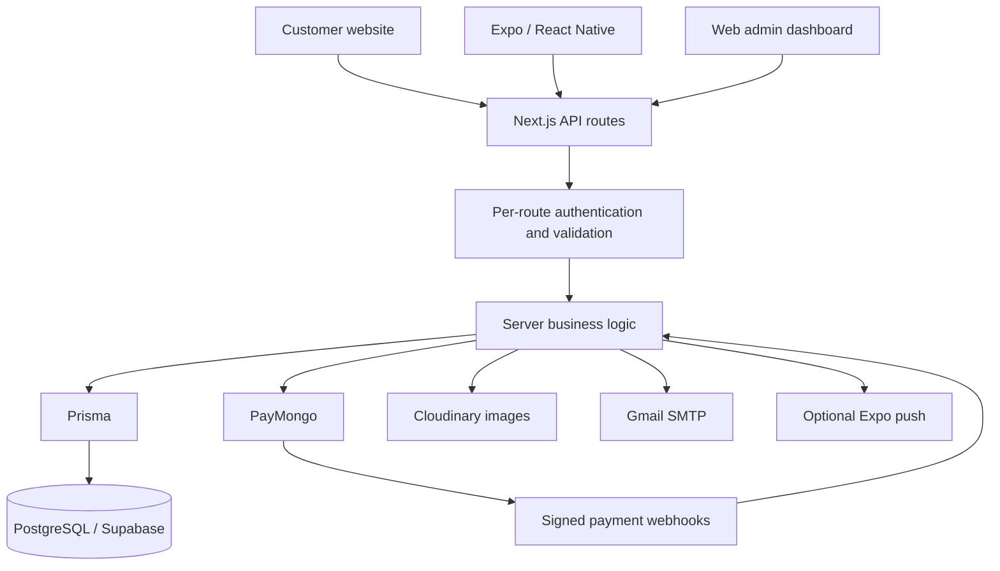

# RePXL ? System Architecture

RePXL has two customer clients (Next.js website and Expo/React Native app) and
a web admin dashboard. All commerce/account mutations use the Next.js API and
PostgreSQL through server-side Prisma. This guide includes the lasting technical
material from the former onboarding audit; point-in-time Git findings and stale
feature inventories have been removed.

## System overview

```mermaid
flowchart TB
    Web[Customer website] --> API[Next.js API routes]
    Mobile[Expo / React Native] --> API
    Admin[Web admin dashboard] --> API
    API --> Guards[Per-route authentication and validation]
    Guards --> Services[Server business logic]
    Services --> Prisma[Prisma]
    Prisma --> DB[(PostgreSQL / Supabase)]
    Services --> PayMongo[PayMongo]
    PayMongo --> Webhooks[Signed payment webhooks]
    Webhooks --> Services
    Services --> Cloudinary[Cloudinary images]
    Services --> Email[Gmail SMTP]
    Services --> Push[Optional Expo push]
```

There is no central Next.js authentication middleware. Protected handlers call
`getCurrentUser()` or `getCurrentAdmin()` themselves and enforce resource
ownership, role, and relevant recent-auth/super-admin checks. The diagram's guard
stage represents those checks inside handlers.

## Repository map

| Area | Source | Responsibility |
|---|---|---|
| Website entry | `src/app/layout.tsx`, `src/app/page.tsx` | Shared providers/layout and landing page |
| Customer routes | `src/app/(storefront)/`, `src/app/(auth)/` | Shopping, account, checkout, sign-in |
| Admin routes | `src/app/(admin)/admin/` | Inventory, orders, customers, returns, CMS |
| API | `src/app/api/` | Authenticated/public HTTP contracts |
| Business logic | `src/lib/` | Validation, payments, returns, security, delivery |
| Website state | `src/stores/`, `src/lib/data/` | Zustand views and API services |
| Database | `prisma/schema.prisma`, `prisma/migrations/` | Models and committed migrations |
| Native UI | `react-native/app/`, `react-native/context/AppContext.tsx` | Expo Router screens and fetched views |
| Native transport | `react-native/src/services/` | API, SecureStore session, push registration |
| Verification | `src/**/*.test.ts`, `vitest.config.ts` | Root Vitest suites, including mobile pure logic/contracts |

The `@/*` alias points to `src/*`. Root TypeScript/Vercel builds exclude the native
workspace; it has its own dependencies, TypeScript check, and Expo build.
Authenticated account/commerce data is server-authoritative. Browser/native
storage is not a successful substitute for a failed order or account mutation.

## Authentication and security

- Website sessions are HMAC-signed HTTP-only cookies. Customer sessions last
  seven days; admin sessions use a separate one-hour cookie. `NEXTAUTH_SECRET`
  signs sessions and is required in production.
- Mobile sessions use random opaque access/refresh tokens stored as SHA-256
  hashes in `MobileSession`; raw tokens remain in Expo SecureStore. Access tokens
  last 15 minutes, refresh tokens 30 days, and rotate on refresh. The shared
  customer guard accepts mobile bearer tokens; mobile sessions are customer-only.
- NextAuth handles Google OAuth. The mobile bridge exchanges a short-lived,
  single-use ticket through `/api/mobile/auth/google/exchange` after returning
  to `repxl://auth/callback`.
- Customer MFA uses TOTP, encrypted secrets, hashed recovery codes, and versioned
  sessions. `src/lib/mfa/` implements encryption, challenges, and same-origin
  checks. Sensitive account changes use recent-auth and OTP challenges.
- PayMongo webhooks verify signatures; shipping webhooks authenticate through
  `SHIPPING_WEBHOOK_SECRET`. Preserve these checks and raw-body handling.
- Return evidence uses Cloudinary authenticated delivery and authorized signed
  downloads; review images use public delivery. These asset classes remain distinct.
- Supabase RLS protects direct Data API access. The application's server Prisma
  connection is the primary database path and can bypass these policies; route
  guards remain essential. Custom RePXL sessions are not Supabase Auth JWTs.

## Database and data ownership

`prisma/schema.prisma` configures PostgreSQL with pooled `DATABASE_URL` for
runtime and `DIRECT_URL` for migrations. `src/lib/prisma.ts` uses a development
singleton and adds pool limits when absent from the URL; configuration overrides
are `PRISMA_CONNECTION_LIMIT` and `PRISMA_POOL_TIMEOUT`.

| Model group | Main records |
|---|---|
| Identity/security | `User`, `CustomerMfa`, `CustomerMfaChallenge`, `RecentAuthRecord`, `SensitiveChangeChallenge`, `PasswordResetToken`, `RetiredAuthEmail`, `MobileSession` |
| Shopping | `Product`, `CartItem`, `WishlistItem`, `Voucher` |
| Orders | `Order`, `OrderItem`, address/payment/tracking snapshots |
| Feedback/returns | `Review`, `ReviewImage`, `ReturnRequest`, `ReturnRequestItem`, `ReturnRequestImage` |
| Account | `Address`, notification preferences, `PushToken` |
| Platform | `StaticPage`, `Banner`, `HomepageContentBlock`, `PlatformSetting`, `NotificationTemplate`, `Notification`, `AdminLog`, `NewsletterSubscriber` |

Check migration state against the current repository/database rather than relying
on an old fixed migration count. Setup and migration commands live in
[SETUP.md](./SETUP.md).

## Checkout, delivery, and integrations

1. Catalog data comes from product APIs. Customer cart, address, wishlist, order,
   and review routes enforce ownership.
2. `/api/checkout/session` creates a pending order and hosted PayMongo session.
   Payment reconciliation and signed webhooks use
   `src/lib/purchase-finalization.ts` to finalize paid orders transactionally,
   deduct inventory, apply voucher usage, and clear the purchased cart items.
3. Admin status/tracking changes use `order-status.ts` and related tracking
   modules. Pending-payment expiry is implemented by `order-payment-expiry*`.
4. Return submission, review, and refunds share the website/mobile records and
   admin process described in [returns.md](./returns.md).
   `src/lib/return-service.ts` coordinates guarded receipt/inspection/restock and
   refund transactions; `src/lib/return-workflow.ts` supplies client-safe monetary
   and milestone rules. Nullable workflow fields are added by migration
   `20261002000000_return_workflow` (prepared, not applied here). Signed refund
   webhooks and admin checks reconcile provider state; only confirmed success
   completes the refund, and partial refunds preserve order payment status PAID.
5. In-app and email notifications share event triggers and preferences; optional
   Expo push accompanies the notification pipeline. Rendering and delivery details
   are in [communications.md](./communications.md).

Other shared API areas include CMS/pages/banners, newsletter double opt-in,
contact/support, and account security. Cloudinary, PayMongo, Gmail, and database
credentials stay on the server. The AI Concierge is local rule-based logic,
with no chat backend; see [customer-experience.md](./customer-experience.md#ai-concierge).

## Stack and maintenance references

Declared versions and scripts are authoritative in the root and native
`package.json` files. The website uses Next.js App Router, TypeScript, React,
Tailwind, Framer Motion, Zustand, Zod, and Prisma. The maintained native workspace
uses Expo SDK 57, Expo Router, React Native, and SecureStore.

- [Setup, environment, deployment, and troubleshooting](./SETUP.md)
- [Native implementation and release work](./mobile-app-development-plan.md)
- [Actual progress, dated verification, and unresolved limits](./Group2_ProjectChecklist.md)

Documentation consolidation checked source paths/configuration and local links;
it did not repeat application tests, builds, provider checks, or device checks.
